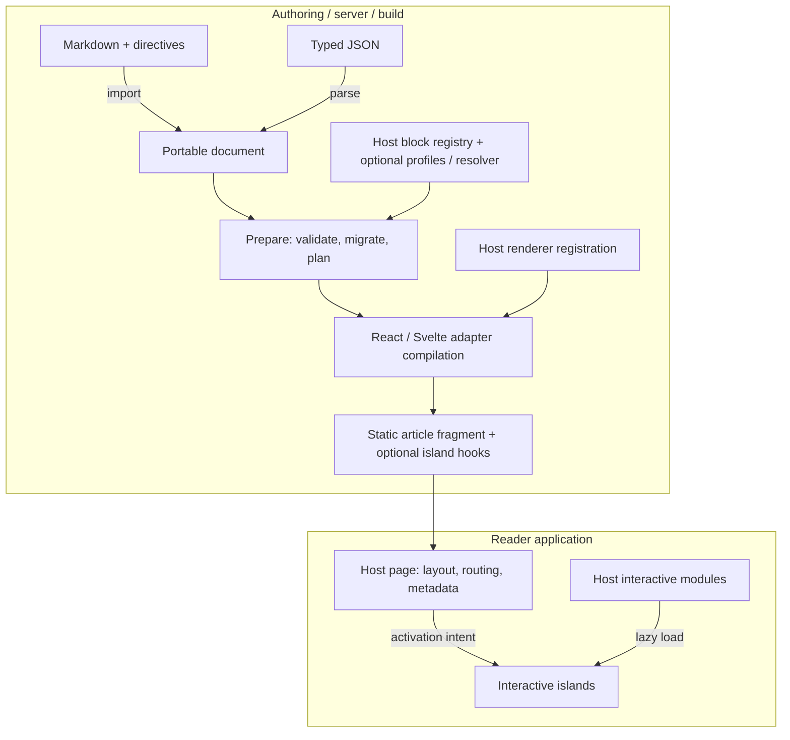

# Publisle

Portable semantic articles, compiled into static content with optional interactive islands.

Publisle is a publishing toolkit for technical articles, research papers, and
interactive explanations. Author content as Markdown or typed JSON, validate it
against a portable schema, and publish it through React or Svelte adapters.
Your application keeps control of layout, navigation, routing, and page metadata.

## What it solves

Rich articles often become tied to a framework, hide their interactive data
inside application code, or ship an editor and parser to every reader. Publisle
separates the **document**, its **validation**, and its **rendering**:

- Keep article structure and plugin payloads in versioned, portable data.
- Reuse that document across supported hosts without embedding page layout.
- Validate and migrate content at a trusted server/build boundary.
- Publish static content without Publisle's schema, Markdown parser, or editor
  in the static reader bundle; activate interactive code only when needed.

## What you can publish

- CommonMark/GFM content: headings, lists and tasks, quotes, code, tables, links,
  images, and inline formatting.
- Mathematical and publication content: inline/display LaTeX with color support,
  figures and captions, labeled equations, footnotes, citations, and cross-references.
- Restricted embeds and source-preserving diagrams with accessible/print fallbacks.
- Custom typed blocks with host-owned static renderers and interactive modules.

Math renders through KaTeX at build time. Diagram engines and interactive
implementations are supplied by the host: the playgrounds demonstrate optimized
Mermaid rendering and a [Three.js scene](examples/scene-demo/README.md), but neither
engine is a dependency of Publisle's portable core. Canonical Markdown can retain
complete interactive JSON payloads; it does not infer what arbitrary renderer
code does.

## How the system fits together



The portable schema knows the content, not the UI framework. Preparation produces
diagnostics, reference/resource plans, and a cache identity. Adapters compile the
article for the host; they do not take over the page. Authored or registered static
fallbacks can remain readable before activation and without JavaScript.

Interactive islands support `load`, `visible`, `idle`, and `interaction` activation.
Only referenced implementations are included, with shared loading and independent
instance state. Framework JavaScript still follows the host's rendering policy.

## Try the playgrounds

This repository is a source workspace, not a prebuilt standalone npm distribution.
Use Node **24+** and pnpm **11.17+ (11.x)**:

```sh
pnpm install

# Choose a playground:
pnpm --filter @publisle/playground-svelte dev
# Or:
pnpm --filter @publisle/playground-react dev
```

Both playgrounds let you build and preview articles, edit payloads, and
import/export Markdown or JSON. Choose **Load Fourier article** for a
[mathematical feature tour](examples/articles/README.md).

## Integrate and extend

Start with the [developer guide](docs/developer-guide.md) and the complete
[React](examples/react) or [Svelte](examples/svelte) integrations. The guide covers
Markdown codecs, schema migrations, conformance profiles, resource/cache contracts,
and native static/interactive renderers.

The optional [Node CLI](docs/developer-guide.md#optional-node-validation-and-source-upgrades)
validates without writing and previews upgrades by default; replacing source
requires explicit authorization. Pure metadata, outline, and reference helpers
return data without changing the host page.

## Development

```sh
pnpm check
pnpm exec playwright-core install --with-deps chromium
pnpm test:acceptance
```

These checks cover types, lint, formatting, unit tests, production builds, and
real-browser React/Svelte acceptance. See the
[verification notes](docs/developer-guide.md#verification) for bundle and lifecycle
coverage.

## License

[MIT](LICENSE) — Copyright © 2026 VoidReg.
