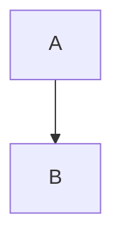

# Publisle

Portable semantic documents. A host page owns layout, navigation, and routing. Publisle compiles the article into a fragment the host can place inside that layout.

## Markdown

`@publisle/markdown` converts between CommonMark/GFM and Publisle documents:

```ts
import { fromMarkdown, toMarkdown } from "@publisle/markdown";

const imported = fromMarkdown(source);
if (!imported.document) throw new Error("Invalid Markdown");

const exported = toMarkdown(imported.document);
```

Canonical Markdown retains complete interactive JSON payloads in fenced
`publisle-payload` blocks. Choose readable (default) or compact JSON:

```ts
const exported = toMarkdown(imported.document, {
  payloadFormatting: "compact",
});
```

Both formats round-trip without losing payload structure. External source URIs
remain references; export does not fetch or inline external resources. Payloads
describe instance data, while the user-defined block contract documents how its
renderer interprets that data. Neither format infers arbitrary renderer behavior.

For blocks without a native Markdown mapping, both `policy: "warn"` and
`policy: "fallback"` emit a warning and preserve the block in a generic Publisle
directive, including its ID, type, schema version, and JSON data. `fallback` is
the default. `policy: "strict"` instead returns error diagnostics without Markdown.
`warn` does not omit unsupported blocks; preservation does not provide a renderer
for an unavailable plugin.

The React and Svelte playgrounds include a **3D Scene** example with orbit,
selection, and camera reset controls. Its schema and Three.js renderer belong
entirely to the host-side [scene demo](examples/scene-demo/README.md); Publisle
does not depend on Three.js. Edit its JSON payload and choose **Readable** or
**Compact** payload formatting when exporting Markdown.

Publisle has native nodes for GFM task lists, tables, footnotes, inline/display
math, citations, and cross-references. Publication extensions use directives:

````md
:::figure{src="diagram.svg" alt="Pipeline" label="fig:pipeline" original="diagram.pdf"}
:::caption
The publication pipeline.
:::
:::

See :ref[fig:pipeline] and :cite[doe2026]{locator="12" label="page"}.

:::diagram{engine="mermaid" alt="A points to B" label="diagram:flow"}



:::fallback
A points to B.
:::
:::
````

Embeds use provider IDs rather than arbitrary iframe URLs. YouTube and Vimeo
are built in; hosts can register additional providers and synchronous diagram
renderers through adapter compiler options.

Math is rendered at build time with KaTeX, including `\color`, `\textcolor`,
`\colorbox`, and `\fcolorbox`. Applications that render math should load both:

```ts
import "@publisle/adapter-core/document.css";
import "@publisle/adapter-core/katex.css";
```

Every interactive block uses the same directive. Attributes carry `type`, `schemaVersion`, `id`, and `activation`. `title`, `description`, `instructions`, and `fallback` are content slots. The `publisle-payload` fence is the component configuration. `label` is an accessible name, used when the visible title cannot name the region.

````md
:::interactive{type="publisle:interactive-schematic" schemaVersion="2" activation="interaction" label="Interactive clocked counter"}
:::title
Clocked counter
:::

:::description
Observe the output on each clock edge.
:::

```publisle-payload
{ "source": "./counter.json" }
```

:::
````

## Publication

`publislePublication` compiles each Markdown module into a publication artifact. The host renders that artifact with `PublisleArticle` and supplies island implementations at runtime. `publisleSvelte()` and `publisleReact()` remain available when a project wants native Svelte or React components instead of a publication fragment.

### Native static components

For an interactive block's native static visualization, register a host renderer with
`renderers: { "acme:example": { static: { module: "./StaticExample", exportName: "default" } } }`
in the React or Svelte adapter options. Static renderers are imported directly
and rendered with the block's props during SSR/build rendering, including when
used as an interactive island's fallback. Named exports are supported, repeated
instances share an import, and each instance receives its own props. Missing
modules or exports fail the host build rather than producing empty placeholders.
Static renderer modules must be SSR-safe; keep interactive code in the separately
registered `interactive` module. Static-only generated documents do not import
Publisle's island bootstrap; any framework JavaScript follows the host's policy.

The runtime `PublisleContent` convenience components instead walk a render plan.
Their async component loaders mount static components on the client and do not
provide SSR for those components. Use native generated output when a registered
static component must be readable before activation or without JavaScript.
Publication artifacts continue to support authored fallback markup; registering
a native component is not an HTML-fragment renderer.

### SvelteKit

```ts
// vite.config.ts
import { publislePublication } from "@publisle/adapter-core/vite";
import { coreBlockDefinitions } from "@publisle/blocks-core";
import { interactiveSchematicDefinition } from "@publisle/blocks-technical";
import { createRegistry } from "@publisle/core";
import { sveltekit } from "@sveltejs/kit/vite";

const registry = createRegistry([
  ...coreBlockDefinitions,
  interactiveSchematicDefinition,
]);

export default {
  plugins: [publislePublication({ registry }), sveltekit()],
};
```

```svelte
<script>
  import PublisleArticle from "@publisle/adapter-svelte/article";
  import "@publisle/adapter-core/document.css";
  import { metadata, publication } from "./article.md";
  import Schematic from "$lib/Schematic.svelte";

  const implementations = {
    "publisle:interactive-schematic": () =>
      Promise.resolve({ default: Schematic }),
  };
</script>

<h1>{metadata?.title}</h1>
<PublisleArticle {publication} instanceId="article" {implementations} />
```

### React

Use `publislePublication()` before the React Vite plugin. Markdown modules export `publication`, `metadata`, and `diagnostics`. Render the fragment with `PublisleArticle` from `@publisle/adapter-react`.

See [`examples/svelte`](./examples/svelte) and [`examples/react`](./examples/react) for complete integrations.

## Playgrounds

Interactive visual builders are available in both React and Svelte flavours:

```bash
pnpm --filter @publisle/playground-react dev
pnpm --filter @publisle/playground-svelte dev
```

They let you assemble an article from blocks, preview it live, and import/export Markdown or JSON.
