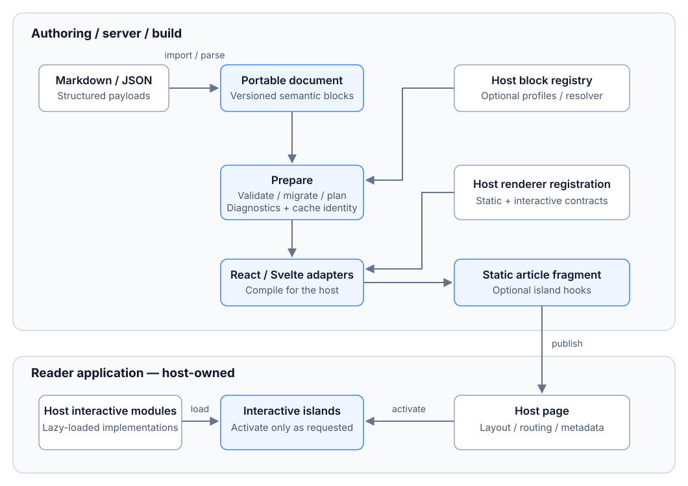

<div align="center">
  <picture>
    <source media="(prefers-color-scheme: dark)" srcset="docs/assets/brand/lockup-dark.svg" />
    
  </picture>
  <p><strong>Portable semantic articles, compiled into static content with optional interactive islands.</strong></p>
  <p>
    <a href="https://github.com/VoidReg/publisle/actions/workflows/check.yml"></a>
    
    
    
  </p>
</div>

Publisle is a publishing toolkit for technical articles, research papers, and
interactive explanations. Author content as Markdown or typed JSON, validate it
against a portable schema, and publish it through React or Svelte adapters.
Your application keeps control of layout, navigation, routing, and page metadata.

The tool is in beta: existing version numbers remain frozen while contracts evolve.
See the [beta standards](docs/standards/README.md) and [preparation-only contract tooling](docs/guides/contracts.md)
for the implemented portable subset and its limitations.

Publisle separates a lean **Core** (this document model, validation, and static
publication — no TeX, citeproc, or template dependency) from the optional
**Research profile** for scholarly publishing: citation resolution, journal
templates, LaTeX/JATS/PDF export, and a pinned compiler toolchain
([publishing standard](docs/standards/publishing.md),
[export guide](docs/guides/journal-export.md)). Core adopters never install it.

## Core quickstart

Use the [source workspace](#try-the-playgrounds) with Node 24+ and pnpm 11.x.
This example uses only Core packages:

```ts
import { document } from "@publisle/schema";
import { paragraph, coreBlockDefinitions } from "@publisle/blocks-core";
import { createRegistry, prepare, assertPrepared } from "@publisle/core";
import { compilePublication } from "@publisle/adapter-core";

const article = document({
  metadata: { title: "First article", language: "en" },
  blocks: [
    paragraph({
      content: [{ type: "text", value: "Readable without JavaScript." }],
    }),
  ],
});
const prepared = assertPrepared(
  prepare(article, { registry: createRegistry(coreBlockDefinitions) }),
);
const publication = compilePublication(prepared);
```

The publication is an article artifact for your host to render. Follow the
[framework host guide](docs/guides/framework-hosts.md) for native components or
artifact delivery. Core installs no citeproc, TeX, xmllint, Docker or Research
templates. See the [documentation index](docs/README.md),
[Core standards](docs/standards/README.md) and
[governance policy](docs/governance.md) for the contracts and beta limits.

## What it solves

Rich articles often become tied to a framework, hide their interactive data
inside application code, or ship an editor and parser to every reader. Publisle
separates the **document**, its **validation**, and its **rendering**:

- Keep article structure and plugin payloads in versioned, portable data.
- Reuse that document across supported hosts without embedding page layout.
- Validate and migrate content at a trusted server/build boundary.
- Publish static content without Publisle's schema, Markdown parser, or editor
  in the static reader bundle; activate interactive code only when needed.

## What you can publish

- CommonMark/GFM content: headings, lists and tasks, quotes, code, tables, links,
  images, and inline formatting.
- Mathematical and publication content: inline/display LaTeX with color support,
  figures and captions, labeled equations, footnotes, citations, and cross-references.
- Restricted embeds and source-preserving diagrams with accessible/print fallbacks.
- Custom typed blocks with host-owned static renderers and interactive modules.

Math renders through KaTeX at build time. Diagram engines and interactive
implementations are supplied by the host: the playgrounds demonstrate optimized
Mermaid rendering and a [Three.js scene](examples/scene-demo/README.md), but neither
engine is a dependency of Publisle's portable core. Canonical Markdown can retain
complete interactive JSON payloads; it does not infer what arbitrary renderer
code does.

## How the system fits together

<picture>
  <source media="(prefers-color-scheme: dark)" srcset="docs/assets/publisle-system-dark.svg" />
  
</picture>

The portable schema knows the content, not the UI framework. Preparation produces
diagnostics, reference/resource plans, and a cache identity. Adapters compile the
article for the host; they do not take over the page. Authored or registered static
fallbacks can remain readable before activation and without JavaScript.

Interactive islands support `load`, `visible`, `idle`, and `interaction` activation.
Only referenced implementations are included, with shared loading and independent
instance state. Framework JavaScript still follows the host's rendering policy.

## Try the playgrounds

Workspace development resolves TypeScript sources. `pnpm build:packages` builds
ESM, declarations and source maps for packing; `pnpm test:distribution` checks the
packed artifacts in a clean consumer. Registry publication is still pending.
See the [release guide](docs/guides/releases.md). Use Node **24+** and pnpm
**11.17+ (11.x)**:

```sh
pnpm install

# Choose a playground:
pnpm --filter @publisle/playground-svelte dev
# Or:
pnpm --filter @publisle/playground-react dev
```

Both playgrounds let you build and preview articles, edit payloads, and
import/export Markdown or JSON. Choose **Load Fourier article** for a
[mathematical feature tour](examples/articles/README.md).

## Integrate and extend

Start with the [developer guide](docs/developer-guide.md) and the complete
[React](examples/react) or [Svelte](examples/svelte) integrations. The guide covers
Markdown codecs, schema migrations, conformance profiles, resource/cache contracts,
and native static/interactive renderers.

The optional [Node CLI](docs/developer-guide.md#optional-node-validation-and-source-upgrades)
validates without writing and previews upgrades by default; replacing source
requires explicit authorization. Research commands (journal export, bibliography,
compiler setup) live in the separate `@publisle/cli-research` plugin, which the
CLI loads when installed. Pure metadata, outline, and reference helpers
return data without changing the host page.

For immutable contract pins, archival Markdown and offline asset packages, see the
[exchange guide](docs/guides/exchange.md). Native and precompiled artifacts share
the same typed island inputs; full schemas and preparation tooling stay out of readers.

## Research profile

Install the optional `@publisle/research` tooling and the template packages you
need; CLI export, bibliography, doctor and compiler setup are supplied by
`@publisle/cli-research`. The Core CLI reports install guidance when the plugin
is absent. Research provides citation resolution, publisher source packages and
JATS/PDF exports. Its compiler tier is explicit; ordinary readers receive no TeX
or citation processor.

Start with the [Research profile standard](docs/standards/publishing.md) and
[journal export guide](docs/guides/journal-export.md). The
[accessibility guide](docs/guides/accessibility.md) separates tagging requests,
validator evidence and manual review. Template availability does not imply
journal acceptance or PDF/UA certification.

## Standalone Fourier showcase

The [Fourier showcase rehearsal](showcase/fourier/README.md) builds the complete
illustrated tutorial as a standalone Astro site from packed Core packages, with
its existing figures, MathML, tables, styles and authored static fallbacks.
Its lockfile and replay script exercise the actual tarballs outside the workspace.
The released-package public deployment remains pending package publication and a
clean registry install; this local rehearsal does not claim public adoption.

## Development

```sh
pnpm check
pnpm test:conformance:renderer
pnpm exec playwright-core install --with-deps chromium
pnpm test:conformance:p0
pnpm test:distribution
```

These checks cover types, lint, formatting, unit tests, production builds, and
real-browser React/Svelte acceptance. See the
[verification notes](docs/developer-guide.md#verification) for bundle and lifecycle
coverage.

## License

[MIT](LICENSE) — Copyright © 2026 VoidReg.
