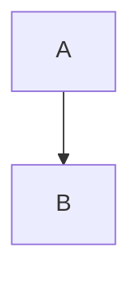

# Developer guide

Detailed integration and API notes for Publisle. For the project overview, system
diagram, and playground setup, see the [README](../README.md).

## Markdown

`@publisle/markdown` converts between CommonMark/GFM and Publisle documents:

```ts
import { fromMarkdown, toMarkdown } from "@publisle/markdown";

const imported = fromMarkdown(source);
if (!imported.document) throw new Error("Invalid Markdown");

const exported = toMarkdown(imported.document);
```

Canonical Markdown retains complete interactive JSON payloads in fenced
`publisle-payload` blocks. Choose readable (default) or compact JSON:

```ts
const exported = toMarkdown(imported.document, {
  payloadFormatting: "compact",
});
```

Both formats round-trip without losing payload structure. External source URIs
remain references; export does not fetch or inline external resources. Payloads
describe instance data, while the user-defined block contract documents how its
renderer interprets that data. Neither format infers arbitrary renderer behavior.

For blocks without a native Markdown mapping, both `policy: "warn"` and
`policy: "fallback"` emit a warning and preserve the block in a generic Publisle
directive, including its ID, type, schema version, and JSON data. `fallback` is
the default. `policy: "strict"` instead returns error diagnostics without Markdown.
`warn` does not omit unsupported blocks; preservation does not provide a renderer
for an unavailable plugin.

### Custom block codecs and authored versions

Register tooling-only `MarkdownBlockCodec`s through the `codecs` option on
`fromMarkdown`, `toMarkdown`, and `formatMarkdown`. Each codec declares a namespaced
block `type`, a positive current `schemaVersion`, a unique native container
`directive` name, and synchronous `decode`/`encode` callbacks. Built-in directive
names/types cannot be replaced. This API covers top-level block directives, not
arbitrary parser extensions or inline codecs; reader renderers remain separate.

For example, a user-owned notice plugin can expose this codec alongside its
portable definition (the definition owns schema validation and migrations):

```ts
import { isPlainObject } from "@publisle/schema";
import type { MarkdownBlockCodec } from "@publisle/markdown";

export const noticeCodec: MarkdownBlockCodec = {
  type: "demo:notice",
  directive: "notice",
  schemaVersion: 2,
  decode(node, { schemaVersion }) {
    const message = node.attributes?.["message"];
    if (typeof message !== "string") throw new Error("Missing message");
    return schemaVersion === 1 ? { text: message } : { message };
  },
  encode(block, { policy }) {
    if (!isPlainObject(block.data)) return undefined;
    const message = block.data[block.schemaVersion === 1 ? "text" : "message"];
    if (typeof message !== "string") return undefined;
    return policy === "standard"
      ? { type: "paragraph", children: [{ type: "text", value: message }] }
      : {
          type: "containerDirective",
          name: "notice",
          attributes: { message },
          children: [],
        };
  },
};
```

```ts
const imported = fromMarkdown(':::notice{message="Hello"}\n:::\n', {
  codecs: [noticeCodec],
  resolveSchemaVersion: (type) => registry.get(type)?.schemaVersion,
});
const exported = toMarkdown(imported.document!, { codecs: [noticeCodec] });
```

Decoders receive a cloned directive AST, resolved schema version, and original
source location. Their result must be JSON-compatible data; import does not run
plugin validators or migrations. Encoders receive a cloned semantic block and
export options with the effective policy. Native output must be the codec's
registered container directive; export automatically records the source block's
schema version. A standard encoder can return plain Markdown without extension
directives and receives an `extension-semantics-lost` warning. Return `undefined`
to opt out of an unsupported version/policy. Under strict policy, codec failures
or opt-outs produce errors and no Markdown; warn/fallback preserve the complete
block via its generic directive with a warning. Failed decoding is fatal rather
than guessing at malformed data. Invalid or duplicate registrations also fail
with structured diagnostics. Codec callbacks are trusted host code, not a sandbox.

For authored native extensions without `schemaVersion`, import checks
`resolveSchemaVersion(type)` first, then the codec's current version or a built-in
definition's version. Unknown interactive types retain their JSON payload at
version 1 with `unresolved-markdown-version`; supply an explicit version or lookup
to remove the ambiguity. Explicit versions bypass current-version lookup and are
preserved even if newer than the registry; only preparation migrates or rejects
unsupported versions. Generic `:::publisle` forms are archival: their explicit
versions/data bypass native codecs, and an omitted archival version retains the
legacy version-1 default. Without a codec, unknown native directives remain raw
source, while generic forms preserve typed JSON; use generic forms for portable
exchange with hosts that lack the codec.

Vite adapters accept `markdownCodecs` and use their host registry automatically
for current-version resolution. Both playground editors also use their registry
on import. `formatMarkdown` accepts the same codec/version options plus export
policy/formatting options, allowing deterministic native reformatting. None of
these registrations become article fields or reader dependencies. See the
[tested notice codec](../packages/markdown/tests/fixtures/notice-codec.ts) for an
example with a separate v1-to-v2 migration.

The React and Svelte playgrounds include a **3D Scene** example with orbit,
selection, and camera reset controls. Its schema and Three.js renderer belong
entirely to the host-side [scene demo](../examples/scene-demo/README.md); Publisle
does not depend on Three.js. Edit its JSON payload and choose **Readable** or
**Compact** payload formatting when exporting Markdown.

Publisle has native nodes for GFM task lists, tables, footnotes, inline/display
math, citations, and cross-references. Publication extensions use directives:

````md
:::figure{src="diagram.svg" alt="Pipeline" label="fig:pipeline" original="diagram.pdf"}
:::caption
The publication pipeline.
:::
:::

See :ref[fig:pipeline] and :cite[doe2026]{locator="12" label="page"}.

:::diagram{engine="mermaid" alt="A points to B" label="diagram:flow"}



:::fallback
A points to B.
:::
:::
````

Embeds use provider IDs rather than arbitrary iframe URLs. YouTube and Vimeo
are built in; hosts can register additional providers and synchronous diagram
renderers through adapter compiler options.

Math is rendered at build time with KaTeX, including `\color`, `\textcolor`,
`\colorbox`, and `\fcolorbox`. Applications that render math should load both:

```ts
import "@publisle/adapter-core/document.css";
import "@publisle/adapter-core/katex.css";
```

Every interactive block uses the same directive. Attributes carry `type`, `schemaVersion`, `id`, and `activation`. `title`, `description`, `instructions`, and `fallback` are content slots. The `publisle-payload` fence is the component configuration. `label` is an accessible name, used when the visible title cannot name the region.

````md
:::interactive{type="publisle:interactive-schematic" schemaVersion="2" activation="interaction" label="Interactive clocked counter"}
:::title
Clocked counter
:::

:::description
Observe the output on each clock edge.
:::

```publisle-payload
{ "source": "./counter.json" }
```

:::
````

## Publication

### Optional Node validation and source upgrades

The source workspace includes `@publisle/cli` and its `publisle` bin entrypoint.
The Core CLI covers `validate`, `upgrade`, `lock`, `inspect`, `semantic`, and
`reading`. Research commands (`export`, `bibliography`, `doctor`,
`setup compiler`) belong to the optional `@publisle/cli-research` plugin: the
Core CLI loads it when installed and otherwise explains how to add it, so a
Core-only install never pulls the Research toolchain.
Use Node >=24 (strip-only TypeScript, as with the workspace packages) and the root
script; this is not a prebuilt standalone npm distribution:

`pnpm exec publisle ...` invokes the workspace bin directly without script-runner
output, useful when piping an upgrade preview.

```sh
pnpm cli validate article.json
pnpm cli validate article.md --config ./publisle.config.ts
pnpm cli upgrade article.json --config ./publisle.config.ts
pnpm cli upgrade article.md --config ./publisle.config.ts --output article.upgraded.md
pnpm cli upgrade article.json --config ./publisle.config.ts --in-place
```

Validation never rewrites source. Upgrade defaults to a stdout preview; diagnostics
go to stderr. `--output` creates a new file and refuses existing targets (including
symlinks); only `--in-place` authorizes source replacement. In-place upgrades stage
the result beside the source, preserve ordinary permission bits, check the source
has not changed, then rename atomically. Symlinks and multiply hard-linked inputs
are rejected for in-place writes. This is not a filesystem lock or archival backup:
avoid concurrent editors, review previews, and use version control. Ownership,
extended attributes and timestamps are not preserved by inode replacement.
Document errors exit 1; usage/config/I/O errors exit 2; warnings permit exit 0.

Default registration covers `@publisle/blocks-core` only. Validation rejects unknown
block types; upgrades preserve them with warnings. A config's explicit
`prepare.unknownBlocks` overrides that default. Provide a trusted explicit `.ts`
(erasable syntax), `.mjs`, or ESM `.js` config exporting a default `CliConfig`:

```ts
import { coreBlockDefinitions } from "@publisle/blocks-core";
import { interactiveSchematicDefinition } from "@publisle/blocks-technical";
import { createRegistry } from "@publisle/core";
import { researchPaperProfile } from "@publisle/research";
import type { CliConfig } from "@publisle/cli";

export default {
  prepare: {
    registry: createRegistry([
      ...coreBlockDefinitions,
      interactiveSchematicDefinition,
    ]),
    profiles: [researchPaperProfile()],
    diagnosticPolicy: { "missing-title": "error" },
    // documentMigrations, resourceResolver and preparationVersion are also accepted.
  },
  markdown: { codecs: [] }, // Your user-owned native directive codecs.
} satisfies CliConfig;
```

Configs/plugins execute with the host's authority: never load untrusted code.
There is no automatic config discovery, asset fetching, browser rendering or
renderer registry requirement. Resolver-relative paths are the host's responsibility.
One input is accepted per invocation; `.json`, `.md`, and `.markdown` are inferred.
`--format json|markdown` explicitly sets the input **and output** format for other
extensions; this command is an upgrade, not a cross-format converter.

Upgrades use public parse/import/prepare/export APIs to serialize the current wire
envelope, not prepared plans. Migrations and normalization run in memory; the
document envelope remains v1. Missing/failed migrations or profile errors prevent
all output. Unknown plugin payloads/versions/IDs are retained via JSON or generic
archival Markdown where representable. JSON upgrades reject unmodeled source
fields rather than silently discard them. Markdown always uses native `fallback`
export, then reimports and checks metadata/block types/versions/payloads; semantic
loss refuses output. Source formatting/comments may change. Native Markdown can
regenerate block IDs (reported as a warning); use JSON when identity must persist.
No lossy `standard` export or forced-write switch is offered.
Payload changes from registered parsing/defaults/normalization without a schema
version change produce `block-data-normalized` warnings for preview review.

For tooling integrations, `processSource(source, options)` from `@publisle/cli`
returns diagnostics and optional upgraded output without file I/O.
`runCli(args, { stdout, stderr })` from `@publisle/cli/run` is the Node runner.
Keep this optional tooling package out of browser imports; existing render/build
operations still never rewrite article sources.

### Pure document helpers

At a server/build boundary, `@publisle/core` provides optional data-only helpers:

```ts
import {
  getDocumentMetadata,
  getDocumentOutline,
  getDocumentReferences,
} from "@publisle/core";

const metadata = getDocumentMetadata(prepared); // PublicationMetadata | undefined
const outline = getDocumentOutline(prepared); // readonly DocumentOutlineEntry[]
const references = getDocumentReferences(prepared); // readonly ReferenceTarget[]
```

Each call returns an independent view; mutating a result cannot change the prepared
document or its cache identity. Metadata preserves authored fields and extensions,
returning `undefined` when absent. Nothing is inferred for SEO or the page head.
The flat outline contains `{ blockId, level, title, label?, pointer? }` for
declared headings in document order, including unlabeled headings, nested flow
nodes and custom paths explicitly registered through a bounded traversal. It does
not scan opaque payloads, synthesize anchors, or impose a hierarchy. Nested paths
carry a pointer relative to their owning block. Titles flatten formatting/link children, preserve
inline code and literal LaTeX, use image alt text, and replace breaks with spaces.
Raw HTML, citations, footnote markers, and implicit cross-reference labels are
omitted rather than interpreted; explicit cross-reference children are retained.
References are copied directly from preparation's targets, preserving their
existing titles and kind-specific numbering, not recalculated outline titles.
The host owns linking block IDs to rendered elements, head/search contributions,
routing, layout, and metadata policy. These helpers require no browser or adapter
and should not be imported into a static reader bundle.

### Migrations and diagnostic locations

`prepare()` accepts `documentMigrations`, an ordered-by-version collection of
`{ from, migrate }` steps separate from each block definition's migrations.
An envelope step receives an isolated copy and must return a complete valid
document at exactly `from + 1`. Envelope migration happens before block lookup,
validation, and profile inspection; no source files are rewritten. Missing,
duplicate, throwing, or invalid steps produce `document-migration-failed` errors.
Unsupported envelope versions are rejected. Publisle's envelope remains v1:
there is no invented v0 format or host option to accept a newer unsupported
envelope. The hook supports future supported version upgrades.

Markdown imports return an optional `sourceMap` sidecar keyed by stable block ID:

```ts
const imported = fromMarkdown(source, { sourceName: "article.md" });
if (!imported.document) throw new Error("Invalid Markdown");
const prepared = prepare(imported.document, {
  registry,
  ...(imported.sourceMap ? { sourceMap: imported.sourceMap } : {}),
});
```

Locations use original-source, one-based lines/columns and zero-based character
offsets, including after interactive fence normalization. Import, preparation,
profile, and renderer diagnostics retain supplied locations; block-level findings
point to the original block start, and envelope-level findings use the document
start. The prepared plan can carry the sidecar, but article JSON and canonical
Markdown do not. Code-authored documents do not need source maps. Migrations should
retain block IDs; newly generated IDs without a mapping use the document location.
Block migration failures now use `migration-failed`, distinct from
`invalid-block-data`. Vite adapters propagate source maps and original locations
to build errors without shipping Markdown parsers or migrations to readers.

### Optional conformance profiles

Preparation enforces structural integrity by default. Publication conventions
are opt-in and can be configured at a server/build boundary:

```ts
import { prepare } from "@publisle/core";
// Research profiles ship with the optional Research profile, not the Core set.
import { researchPaperProfile } from "@publisle/research";

const result = prepare(document, {
  registry,
  profiles: [researchPaperProfile()],
  diagnosticPolicy: {
    "missing-abstract": "warning",
    "missing-affiliation": "info",
  },
});
```

Profile diagnostics include their profile name. Policy maps diagnostic codes to
`info`, `warning`, or `error` and applies only to profile findings: structural
errors cannot be downgraded. Profile warnings/info allow a prepared document;
profile errors prevent publication. Inspectors run after successful structural
preparation, receive independent deeply frozen normalized semantic snapshots,
and cannot rewrite source or prepared content. Inspector failures are reported as
fatal `profile-inspection-failed` diagnostics and cannot be suppressed by policy.
Profiles are trusted host code, not a sandbox for arbitrary JavaScript.

The research-paper profile checks nonblank titles, authors, author affiliations,
missing figure alternative text, and declared nested heading jumps (including starting
below level 1). It recognizes an abstract heading named **Abstract** or labeled
`abstract`, immediately followed by a nonempty prose paragraph. For other titles,
use `researchPaperProfile({ abstractLabel: "sec:summary" })`. Metadata descriptions
are not abstracts; this profile does not assess scientific quality or infer an
abstract from opaque custom blocks. Preparation supplies each profile a separate
deeply frozen traversal context, so explicitly declared custom heading/paragraph
paths participate in the same abstract check. Direct profile calls without a
context retain their top-level behavior. See the [meaning guide](guides/meaning.md)
for declarations, readable associations and limits. Figure alt is structurally optional:
omission means undescribed, while an explicit empty string marks a decorative
image. Missing descriptions render a visible "Figure description missing."
notice and nonempty placeholder alt, without changing the source document.
Use `accessibilityProfile()` from `@publisle/profiles` for the automatable
accessibility checks without research-paper conventions. Version 2 covers, all
warnings by default and policy-mappable: declared document language (WCAG
3.1.1), heading level jumps from the document start (1.3.1, 2.4.6), missing
figure alternative text (1.1.1), tables without captions (1.3.1), and links
without accessible names (2.4.4; a link named by an image's alt passes).
Diagram alternative text and embed titles are structural schema requirements
enforced at preparation, so the profile does not recheck them. Math
accessibility is a renderer contract — every math output must carry MathML or a
text alternative — and is asserted in renderer conformance fixtures, not here.
This profile is a presence-and-references check, not a WCAG conformance claim;
keyboard, focus, motion, and announcement behavior need browser or manual
review. Both this profile and the research-paper profile report
`missing-alternative-text`, configurable through `diagnosticPolicy`. Invalid
non-string alt remains a structural error. Native Markdown export preserves
missing alt in a figure directive; standard Markdown uses placeholder alt and
reports semantic loss as usual.

Custom profiles implement the `PublicationProfile` contract exported by schema,
core, and profiles. Give them a stable name and bump their optional `version`
(default `"1"`) when inspection behavior or configuration changes; profile
identities and policy participate in preparation cache identity. No profile is
serialized into the document. The same `profiles` and `diagnosticPolicy` options
are accepted by Vite adapters, which expose warnings in compiled diagnostics and
fail the build on errors without shipping inspectors to readers.

`publislePublication` compiles each Markdown module into a publication artifact. The host renders that artifact with `PublisleArticle` and supplies island implementations at runtime. `publisleSvelte()` and `publisleReact()` remain available when a project wants native Svelte or React components instead of a publication fragment.

### Resource resolution and preparation caches

Blocks declare `ResourceReference`s through their `resources(data)` hook.
Preparation separates shared source resources from derived artifacts:
`prepared.resources.resources` contains canonical sources and dependency
identities; `prepared.resources.artifacts` contains transform/options identities
linked by `sourceIdentity`. A source shared by two transforms is resolved once.
Source identity includes its URI, host revision, and dependency identities, so a
dependency change also invalidates the parent's derived artifacts.

```ts
const registry = createRegistry(blockDefinitions, {
  preparationVersion: "my-blocks@2",
});
const manifest = new Map([
  ["wave.svg", { version: "sha256:wave-content", dependencies: [] }],
]);
const result = prepare(article, {
  registry,
  preparationVersion: "my-publication-config@1",
  resourceResolver: {
    version: "asset-manifest@1",
    resolve: ({ uri }) => manifest.get(uri),
  },
});
```

The resolver is synchronous trusted host code; prepare performs no filesystem or
network I/O. Build a manifest first if discovery requires asynchronous I/O.
Return `undefined` for a missing source or `{ version, uri?, dependencies? }`
for a found source. `version` must be a stable nonempty content hash/revision;
optional `uri` identifies a canonical alias. Dependency entries are source-only
`{ uri }` objects, already resolved by the host relative to the document (not
implicitly relative to their parent resource). Lexically equivalent relative
paths share one lookup; roots and leading `..` remain distinct. URLs retain
their spelling. Aliases share one planned source when their canonical URI,
revision, and dependencies agree, but require separate lookups to discover that
equivalence. Cycles and conflicting canonical revisions fail safely.

Missing sources (`missing-resource`), malformed declarations/results
(`invalid-resource`), resolver exceptions (`resource-resolution-failed`),
plugin resource-extraction failures (`resource-analysis-failed`),
dependency cycles (`resource-dependency-cycle`), and conflicting resolutions
(`resource-resolution-conflict`) are errors associated with the owning block
and original source location when available. Profile severity policy cannot
downgrade them. Without a resolver, declarations remain unchecked references:
preparation normalizes/deduplicates paths but does not verify existence. Asset
generation, URI delivery, authorization, and dependency discovery stay host-owned;
the plan does not rewrite authored resource URLs or generate assets.

`cacheIdentity` includes document content, registry identity, resolved resource
and artifact identities, resolver version, host preparation version, unknown-block
policy, profile names/versions, diagnostic policy, and source maps. Object keys,
registry registration order, and dependency sets are normalized deterministically.
All cache identities change with this preparation implementation revision; do
not reuse older entries. No cache storage is provided. The host owns reuse and
must revalidate external revisions before accepting a cache hit; an old prepared
identity cannot detect a changed file by itself. Hosts must also watch resource
dependencies/invalidate their bundler modules; the Vite adapter forwards the
resolver but does not automatically watch arbitrary host resource locations.

Bump registry `preparationVersion` (default `"1"`) whenever schemas, defaults,
migrations, normalization, resource extraction, or island planning behavior
changes. Bump resolver `version` when its behavior/configuration changes, and
host `preparationVersion` for other preparation configuration (including envelope
migrations). Function source is never hashed. Transform strings should include
their implementation version (for example `thumbnail@2`); transform options must
be finite, acyclic JSON values and require a transform. These explicit versions
are the host's contract, not automatic change detection.

### Native static components

For an interactive block's native static visualization, register a host renderer with
`renderers: { "acme:example": { static: { module: "./StaticExample", exportName: "default" } } }`
in the React or Svelte adapter options. Static renderers are imported directly
and rendered with the block's props during SSR/build rendering, including when
used as an interactive island's fallback. Named exports are supported, repeated
instances share an import, and each instance receives its own props. Missing
modules or exports fail the host build rather than producing empty placeholders.
Static renderer modules must be SSR-safe; keep interactive code in the separately
registered `interactive` module. Static-only generated documents do not import
Publisle's island bootstrap; any framework JavaScript follows the host's policy.

The runtime `PublisleContent` convenience components instead walk a render plan.
Their async component loaders mount static components on the client and do not
provide SSR for those components. Use native generated output when a registered
static component must be readable before activation or without JavaScript.
Publication artifacts continue to support authored fallback markup; registering
a native component is not an HTML-fragment renderer.

### SvelteKit

```ts
// vite.config.ts
import { publislePublication } from "@publisle/adapter-core/vite";
import { coreBlockDefinitions } from "@publisle/blocks-core";
import { interactiveSchematicDefinition } from "@publisle/blocks-technical";
import { createRegistry } from "@publisle/core";
import { sveltekit } from "@sveltejs/kit/vite";

const registry = createRegistry([
  ...coreBlockDefinitions,
  interactiveSchematicDefinition,
]);

export default {
  plugins: [publislePublication({ registry }), sveltekit()],
};
```

```svelte
<script>
  import PublisleArticle from "@publisle/adapter-svelte/article";
  import "@publisle/adapter-core/document.css";
  import { metadata, publication } from "./article.md";
  import Schematic from "$lib/Schematic.svelte";

  const implementations = {
    "publisle:interactive-schematic": () =>
      Promise.resolve({ default: Schematic }),
  };
</script>

<h1>{metadata?.title}</h1>
<PublisleArticle {publication} instanceId="article" {implementations} />
```

### React

Use `publislePublication()` before the React Vite plugin. Markdown modules export `publication`, `metadata`, and `diagnostics`. Render the fragment with `PublisleArticle` from `@publisle/adapter-react`.

See [`examples/svelte`](../examples/svelte) and [`examples/react`](../examples/react) for complete integrations.

## Playgrounds

Interactive visual builders are available in both React and Svelte flavours:

```bash
pnpm --filter @publisle/playground-react dev
pnpm --filter @publisle/playground-svelte dev
```

They let you assemble an article from blocks, preview it live, and import/export Markdown or JSON.

## Verification

`pnpm check` runs type checking, lint, formatting, unit/build-fixture tests, and
all example/playground production builds. Real-browser adapter acceptance runs
separately, and both commands are required by CI:

```bash
pnpm exec playwright-core install --with-deps chromium
pnpm test:acceptance
```

The browser suite uses isolated, minified Vite production fixtures for React and
Svelte with SSR followed by hydration. It checks static-only bundle boundaries,
referenced-only island implementations, all activation intents, readable no-JS
fallbacks, shared loading with independent state, native cleanup, load/export
failures, pending-load cancellation, resource/artifact identities, structural
versus profile validity, and coexistence with host components. Hosts retain
control of head, metadata, routing, and global state. Visibility and idle
scheduling are controlled deterministically; these are correctness/bundle tests,
not simulated-device performance benchmarks.

Acceptance output reports total bundled/gzip bytes alongside separate framework,
Publisle, host, and bundler **rendered module bytes**. Module attribution is a
bundler diagnostic, not an additive breakdown of minified or compressed bytes.
No framework shell bytes count as Publisle overhead. Static-only fixtures assert
zero Publisle runtime/tooling modules and zero attributed Publisle module bytes;
island fixtures allow only the native adapter runtime and island controller,
not schemas, migrations, Markdown codecs, or editor code. Vite's automatic module
preload links are disabled in these fixtures so host-head assertions measure
adapter behavior rather than bundler asset-hint policy.

CI uses the Chromium revision matched to the pinned development-only Playwright
dependency. Locally, set `PUBLISLE_BROWSER_PATH` to a compatible Chromium executable
if desired; installed Google Chrome on Linux is used automatically outside CI.
Browser tests never silently skip when a browser is missing. Fixture servers,
browsers, and temporary build directories are cleaned up after each run.

Generated React islands retain stable props/loaders across host rerenders while
each instance has its own payload/state. Island controllers coalesce overlapping
activation, retain readable fallback on failure, avoid mounting after destruction,
and perform idempotent cleanup even when a host mount returns no instance handle.

## License

Publisle is licensed under the [MIT License](../LICENSE).
