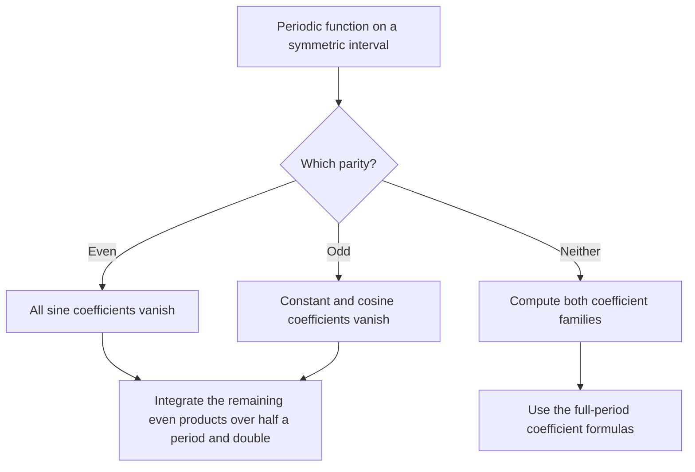
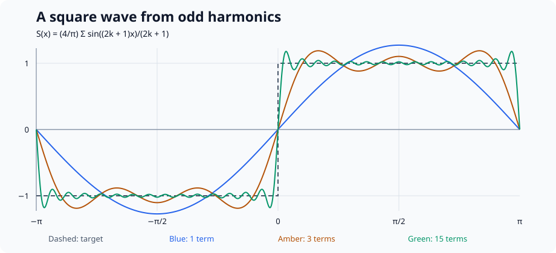
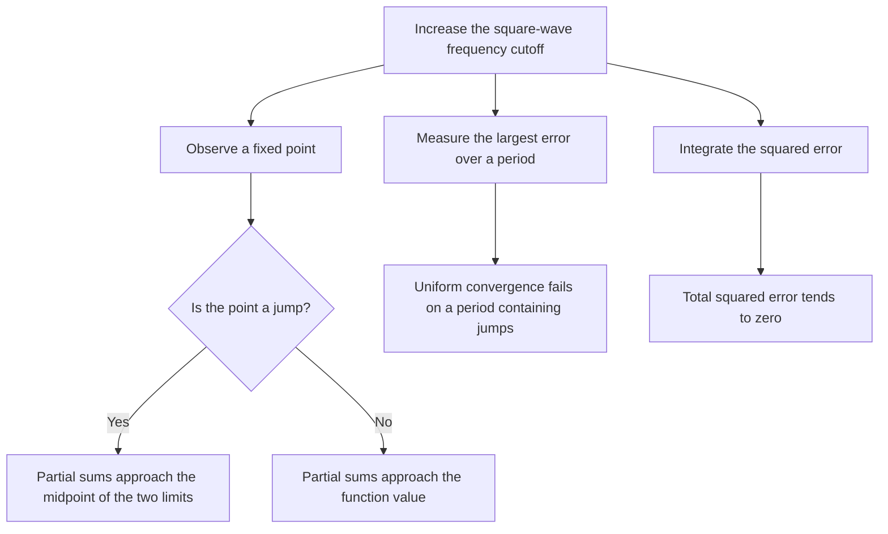
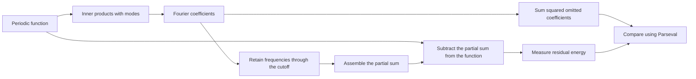
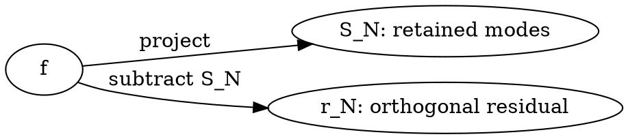
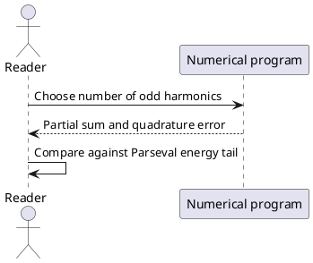

# Fourier Series: Geometry Hidden Inside a Wave

A periodic sound, a vibrating string, and a repeating electrical signal can look completely different. Yet each can be studied by asking the same question: **how much of each simple oscillation does the signal contain?** Fourier series answer that question with coefficients rather than with pictures alone.

The central idea is _orthogonal projection_. Just as a vector has independent components along perpendicular axes, a function has components along mutually orthogonal sine and cosine waves. A partial Fourier sum keeps finitely many of those components; increasing the cutoff gives a richer approximation.

This article develops that connection from the geometry of vectors to the analysis of a square wave. It distinguishes exact identities from numerical experiments, and mathematical convergence from what a plotted curve appears to do.

> A Fourier coefficient is a coordinate of a function in an orthogonal system. The wave picture and the geometry picture describe the same calculation.

## A reading route

- **Start with geometry** if projections are new to you.
- **Start with coefficients** if you already know dot products and integrals.
- **Run the numerical example** if you want to connect the formulas to code.
- **Inspect the scene payload** if you want to see how an interactive illustration carries its own instance data.

By the end, you should be able to:

- [ ] Explain why different Fourier modes do not interfere in the coefficient calculation.
- [ ] Derive the sine coefficients of a square wave.
- [ ] Separate pointwise, uniform, and mean-square convergence.
- [ ] Explain why Gibbs oscillations persist near a jump.
- [ ] Use Parseval's identity as an energy check.
- [x] Distinguish an actual simulator from a static or manually controlled illustration.

The notation `$n$` means a frequency index; `$N$` means a frequency cutoff. The code variable `terms` instead counts how many _nonzero odd harmonics_ we include. These conventions are related, but they are not interchangeable.

---

:::heading{label="sec:projection"}

## 1. Begin with a projection

:::

Take the vector $v=(1.5,1,0.7)$ and the plane $V=\{(x,0,z):x,z\in\mathbb R\}$. Its orthogonal projection is $q=(1.5,0,0.7)$, leaving the residual $r=v-q=(0,1,0)$.

The projection keeps the components that the plane can represent. The residual is perpendicular to every vector in that plane. The Pythagorean theorem gives

$$
\|v\|^2=\|q\|^2+\|r\|^2=2.74+1=3.74.
$$

Why is $q$ the best approximation? For any $w\in V$, the vectors $q-w$ and $r$ are perpendicular, so

$$
\|v-w\|^2=\|r+(q-w)\|^2
=\|r\|^2+\|q-w\|^2\geq\|r\|^2.
$$

The smallest possible error occurs when $w=q$. Fourier approximation will repeat this argument in a space whose vectors are functions.

::::interactive{type="demo:interactive-scene" schemaVersion="1" activation="interaction"}
:::title
Inspect an orthogonal projection in three dimensions
:::

:::description
The pale box represents the $xz$ plane. The orange point is $v=(1.5,1,0.7)$; the blue point is its projection $q=(1.5,0,0.7)$. The green vertical segment represents the residual. This is a fixed geometric illustration, not a Fourier-series simulator.
:::

:::instructions
Activate the scene, drag to orbit, and scroll to zoom. Select a named object to inspect its exact geometry, position, scale, and material. Reset View restores the camera. To change the illustration permanently, edit its JSON payload in the playground.
:::

:::fallback
An orange point lies one unit above a blue point on the $xz$ plane. Their shared horizontal coordinates are $(1.5,0.7)$. The green segment between them is perpendicular to the plane, illustrating $v=q+r$ and $\|v\|^2=\|q\|^2+\|r\|^2$.
:::

```publisle-payload
{
  "background": "#162033",
  "camera": { "position": [4, 3, 5], "target": [0.8, 0.4, 0.3], "fov": 45 },
  "lights": {
    "ambient": { "color": "#ffffff", "intensity": 1.5 },
    "directional": { "color": "#ffffff", "intensity": 3, "position": [3, 5, 4] }
  },
  "objects": [
    { "id": "plane", "name": "Projection plane y = 0", "geometry": { "type": "box", "dimensions": [3.6, 0.025, 2.4] }, "position": [0, -0.08, 0], "rotation": [0, 0, 0], "scale": [1, 1, 1], "material": { "color": "#9cabc1", "roughness": 0.9, "metalness": 0 } },
    { "id": "origin", "name": "Origin (0, 0, 0)", "geometry": { "type": "sphere", "dimensions": [0.08, 0.08, 0.08] }, "position": [0, 0, 0], "rotation": [0, 0, 0], "scale": [1, 1, 1], "material": { "color": "#ffffff", "roughness": 0.5, "metalness": 0 } },
    { "id": "vector-tip", "name": "Vector tip v = (1.5, 1, 0.7)", "geometry": { "type": "sphere", "dimensions": [0.12, 0.12, 0.12] }, "position": [1.5, 1, 0.7], "rotation": [0, 0, 0], "scale": [1, 1, 1], "material": { "color": "#ff9944", "roughness": 0.5, "metalness": 0.1 } },
    { "id": "projection", "name": "Projection q = (1.5, 0, 0.7)", "geometry": { "type": "sphere", "dimensions": [0.12, 0.12, 0.12] }, "position": [1.5, 0, 0.7], "rotation": [0, 0, 0], "scale": [1, 1, 1], "material": { "color": "#4488ff", "roughness": 0.5, "metalness": 0.1 } },
    { "id": "residual", "name": "Residual r = (0, 1, 0)", "geometry": { "type": "cylinder", "dimensions": [0.025, 0.025, 1] }, "position": [1.5, 0.5, 0.7], "rotation": [0, 0, 0], "scale": [1, 1, 1], "material": { "color": "#44cc99", "roughness": 0.5, "metalness": 0.1 } }
  ],
  "controls": { "orbit": true, "pan": true, "zoom": true, "selection": true, "reset": true }
}
```

::::

:::callout{variant="info" title="The payload is data, not a claim about unseen behavior"}
The scene's JSON specifies every object used here. The host renderer interprets its geometry and controls. The component does not perform symbolic integration, animate Fourier modes, or infer a different scene from the prose.
:::

## 2. Functions can have inner products

For real-valued functions on $[-\pi,\pi]$, use the normalized inner product

:::equation{label="eq:inner-product"}

$$
\langle f,g\rangle=\frac{1}{\pi}\int_{-\pi}^{\pi} f(x)g(x)\,dx,
\qquad \|f\|^2=\langle f,f\rangle.
$$

:::

This normalization makes each $\sin(nx)$ and $\cos(nx)$, for positive integer $n$, have norm one. The constant function $1$ has squared norm two. Another normalization is possible; the coefficient and energy formulas must change consistently with it.[^normalization]

Two functions are **orthogonal** when their inner product is zero. They need not look perpendicular in a graph. Orthogonality concerns the integral of their product over a complete period.

### 2.1 Why different modes are orthogonal

For positive integers $m,n$,

$$
\frac{1}{\pi}\int_{-\pi}^{\pi}\sin(mx)\sin(nx)\,dx
=\begin{cases}1,&m=n,\\0,&m\ne n.\end{cases}
$$

The same rule holds for cosine pairs, while every sine-cosine pair integrates to zero. Each nonconstant sine or cosine also integrates to zero against the constant function.

Use the product-to-sum identity to see why:

$$
\sin(mx)\sin(nx)
=\tfrac12\bigl[\cos((m-n)x)-\cos((m+n)x)\bigr].
$$

Every nonzero integer-frequency cosine integrates to zero over $[-\pi,\pi]$. When $m=n$, the first term becomes the constant $1$, producing the surviving integral.

#### 2.1.1 A direct check

Set $m=1$ and $n=3$. Then $\sin x\sin3x=\tfrac12(\cos2x-\cos4x)$; both terms integrate to zero.

##### A useful habit

Check whether the integration interval contains a whole period before applying an orthogonality formula.

###### An endpoint detail

Changing a function at finitely many points does not change these integrals. Pointwise convergence at a discontinuity is nevertheless a separate question.

## 3. Derive the Fourier coefficients

Write the real Fourier expansion as

:::equation{label="eq:fourier-series"}

$$
f(x)\sim\frac{a_0}{2}
+\sum_{n=1}^{\infty}\bigl(a_n\cos nx+b_n\sin nx\bigr).
$$

:::

The symbol $\sim$ indicates the Fourier expansion associated with $f$. It avoids silently promising pointwise equality under every possible assumption.

Multiply :ref[]{target="eq:fourier-series"} by $\cos(mx)$ and integrate. Orthogonality removes every term except the coefficient of that mode. The same calculation with $\sin(mx)$ yields

:::equation{label="eq:coefficients"}

$$
\begin{aligned}
a_0&=\frac1\pi\int_{-\pi}^{\pi}f(x)\,dx,\\
a_n&=\frac1\pi\int_{-\pi}^{\pi}f(x)\cos(nx)\,dx,\\
b_n&=\frac1\pi\int_{-\pi}^{\pi}f(x)\sin(nx)\,dx,\qquad n\geq1.
\end{aligned}
$$

:::

For finite sums, this derivation uses ordinary algebra and integration. For an infinite expansion, exchanging limits and integrals requires justification; the Hilbert-space projection formulation supplies a clean framework for square-integrable functions.

### 3.1 Symmetry does half the work

1. If $f$ is even, $f(x)\sin(nx)$ is odd, so every $b_n$ vanishes.
2. If $f$ is odd, $f(x)\cos(nx)$ is odd, so every $a_n$, including $a_0$, vanishes.
3. For the remaining even integrand, replace an integral over $[-\pi,\pi]$ by twice the integral over $[0,\pi]$.

Use :ref[]{target="diagram:symmetry"} before calculating any integrals. Symmetry can eliminate whole families of coefficients, but it does not determine the values of the surviving ones.

::::diagram{engine="mermaid" label="diagram:symmetry" alt="Check the function's parity. Even functions have no sine coefficients; odd functions have no constant or cosine coefficients; functions with neither symmetry require both families."}



:::caption
Choose the coefficient calculation from the function's symmetry, not from the shape of an individual harmonic.
:::

:::fallback
For an even function, set every sine coefficient to zero. For an odd function, set the constant and cosine coefficients to zero. In either case, double the remaining integral over the positive half-period. With neither symmetry, use the full-period formulas for both families.
:::
::::

:::callout{variant="warning" title="A coefficient is not a point sample"}
The false shortcut ~~$b_n=f(n)$~~ confuses frequency coordinates with function values. A coefficient summarizes correlation with an entire mode over the interval.
:::

Here is a visual memory aid  inside a sentence; the full publication figure appears below.

## 4. A square wave, calculated completely

Define a $2\pi$-periodic function by

$$
f(x)=\begin{cases}
-1,&-\pi<x<0,\\
1,&0<x<\pi,\\
0,&x\in\pi\mathbb Z.
\end{cases}
$$

The endpoint convention gives the midpoint value at every jump. Its assigned value does not affect the coefficients.

Because $f$ is odd, only sine coefficients survive. From :ref[]{target="eq:coefficients"},

$$
b_n=\frac2\pi\int_0^\pi\sin(nx)\,dx
=\frac{2(1-(-1)^n)}{\pi n}
=\begin{cases}\dfrac4{\pi n},&n\text{ odd},\\0,&n\text{ even}.\end{cases}
$$

Thus the square wave has only odd harmonics:

:::equation{label="eq:square-wave"}

$$
f(x)\sim\frac4\pi\left(\sin x+\frac{\sin3x}{3}
+\frac{\sin5x}{5}+\cdots\right).
$$

:::

Each added wave oscillates faster and has a smaller amplitude. Frequency and amplitude are distinct: the third harmonic has frequency $3$ and amplitude $4/(3\pi)$.

::::table{label="table:harmonics"}

| Harmonic $n$ | Parity | Exact $b_n$ | Approximate $b_n$ |
| :----------- | :----: | :---------- | ----------------: |
| $1$          |  Odd   | $4/\pi$     |        $1.273240$ |
| $2$          |  Even  | $0$         |        $0.000000$ |
| $3$          |  Odd   | $4/(3\pi)$  |        $0.424413$ |
| $4$          |  Even  | $0$         |        $0.000000$ |
| $5$          |  Odd   | $4/(5\pi)$  |        $0.254648$ |
| $7$          |  Odd   | $4/(7\pi)$  |        $0.181891$ |

:::caption
The first square-wave coefficients. The index labels frequency, not the order of a nonzero term.
:::
::::

Read :ref[]{target="table:harmonics"} together with :ref[]{target="fig:square-wave"}. A small high-frequency coefficient can still change the shape noticeably near a jump.

::::figure{src="./fourier-square-wave.svg" alt="Square wave and partial sums using one, three, and fifteen odd harmonics. More harmonics sharpen transitions but retain overshoot near jumps." label="fig:square-wave" original="./fourier-square-wave.svg" mediaType="image/svg+xml" filename="fourier-square-wave.svg"}
:::caption
Approximating a square wave on one period. The dashed target has jumps at $0$ and the periodic endpoints. Partial sums use $1$, $3$, and $15$ nonzero odd harmonics; their highest frequencies are $1$, $5$, and $29$.
:::

:::credit
Original illustration generated from the finite sums in :ref[]{target="eq:square-wave"}. Download the SVG original to retain the vector curves and accessible description.
:::
::::

## 5. Three different meanings of convergence

Increasing the cutoff does not have one universal interpretation. Ask what quantity is required to become small.

| Convergence | What becomes small?                         | What the square wave teaches                                                                                               |
| :---------- | :------------------------------------------ | :------------------------------------------------------------------------------------------------------------------------- |
| Pointwise   | $\lvert S_N(x)-f(x)\rvert$ at a fixed $x$   | Convergence at continuity points and to the midpoint at jumps under the usual piecewise-smooth conditions                  |
| Uniform     | $\sup_x\lvert S_N(x)-f(x)\rvert$            | Not possible over a period containing jumps: continuous partial sums cannot converge uniformly to a discontinuous function |
| Mean square | $\int_{-\pi}^{\pi}\lvert S_N-f\rvert^2\,dx$ | The total squared error tends to zero                                                                                      |

### 5.1 What happens at a jump?

For a piecewise-smooth periodic function, the Fourier series at a jump tends to the average of its left and right limits:

$$
S_N(x_0)\longrightarrow\frac{f(x_0^-)+f(x_0^+)}2.
$$

At $x_0=0$ for our square wave, that value is zero. In fact every partial sine sum is exactly zero there because each $\sin(n\cdot0)=0$.

### 5.2 Gibbs oscillations

Near a jump, the partial sums overshoot and undershoot. Adding modes squeezes the oscillation region closer to the jump, but the limiting relative height of the first overshoot does not vanish. This behavior is the **Gibbs phenomenon**.

The apparently paradoxical combination is valid: persistent local peaks can occupy a shrinking region while the integral of squared error tends to zero. A photograph of a peak and a global error measurement answer different questions.

::::diagram{engine="mermaid" label="diagram:convergence" alt="Increasing the square-wave Fourier cutoff gives convergence at fixed points to the midpoint at jumps and to the function elsewhere, and vanishing total squared error, but not uniform convergence over a period containing jumps."}



:::caption
Three tests of convergence applied to this square wave. A shrinking region of Gibbs oscillations is compatible with vanishing mean-square error.
:::

:::fallback
At a fixed continuity point the partial sums approach the square wave; at a jump they approach the midpoint of the one-sided limits. The integrated squared error tends to zero. The largest error over an entire period does not tend to zero, so convergence is not uniform there.
:::
::::

The branches in :ref[]{target="diagram:convergence"} describe different measurements of the same partial sum, not competing predictions.

:::callout{variant="note" title="More resolution is not the same as more uniform accuracy"}
Increasing the number of Fourier modes sharpens the transition. Increasing the number of plotting samples merely helps you see the existing partial sum. Neither operation removes the discontinuity of the target.
:::

For a further treatment of convergence, see the periodic-function material in :cite[mit-1803]. The bibliography links to the original course resources.

## 6. Energy, Parseval, and best approximation

Let $S_N$ retain the constant term and all sine/cosine modes with frequency at most $N$. Orthogonality gives the exact finite-sum identity

$$
\|S_N\|^2=\frac{a_0^2}{2}+\sum_{n=1}^N(a_n^2+b_n^2).
$$

For a square-integrable periodic function, completeness of the trigonometric system gives Parseval's identity:

:::equation{label="eq:parseval"}

$$
\frac1\pi\int_{-\pi}^{\pi}|f(x)|^2\,dx
=\frac{a_0^2}{2}+\sum_{n=1}^{\infty}(a_n^2+b_n^2).
$$

:::

For our square wave the left side is $2$. Substitute its odd coefficients to obtain

$$
2=\frac{16}{\pi^2}\sum_{k=0}^{\infty}\frac1{(2k+1)^2},
\qquad \sum_{k=0}^{\infty}\frac1{(2k+1)^2}=\frac{\pi^2}{8}.
$$

This is both an energy statement and an identity about an infinite numerical series.

### 6.1 Color the decomposition

Use color to distinguish the retained approximation from the omitted residual:

$$
f=\textcolor{RoyalBlue}{S_N}+\textcolor{ForestGreen}{r_N},
\qquad
\|f\|^2=\textcolor{RoyalBlue}{\|S_N\|^2}
+\textcolor{ForestGreen}{\|r_N\|^2}.
$$

The same fact can be highlighted with the label $\textcolor{black}{\colorbox{lightyellow}{Residual energy}}$, a framed label $\textcolor{black}{\fcolorbox{RoyalBlue}{white}{Orthogonality}}$, or a scoped color command ${\color{RoyalBlue}a_n\cos(nx)}$. The boxed labels specify both foreground and background so they remain readable in light and dark themes. The colors supplement the symbols; the argument does not depend on being able to distinguish the colors.

### 6.2 Why the partial sum minimizes error

For any trigonometric polynomial $p$ using only frequencies through $N$, write

$$
f-p=(f-S_N)+(S_N-p).
$$

The residual $f-S_N$ is orthogonal to that entire finite-dimensional mode space. Consequently,

$$
\|f-p\|^2=\|f-S_N\|^2+\|S_N-p\|^2\geq\|f-S_N\|^2.
$$

This is precisely the projection argument from :ref[]{target="sec:projection"}. Fourier approximation minimizes mean-square error among the permitted trigonometric polynomials. It does **not** automatically minimize the largest pointwise error.

## 7. A reproducible numerical experiment

The following program uses only Python's standard library. It approximates the mean-square error with midpoint quadrature, which avoids sampling the jump itself. The analytical energy tail gives a separate reference value.

```python
from math import fsum, pi, sin

def square_wave(x):
    return 1.0 if x > 0 else -1.0 if x < 0 else 0.0

def partial_sum(x, terms):
    return (4 / pi) * fsum(
        sin((2 * k + 1) * x) / (2 * k + 1)
        for k in range(terms)
    )

def midpoint_error(terms, samples=65536):
    step = 2 * pi / samples
    squared_errors = (
        (square_wave(x) - partial_sum(x, terms)) ** 2
        for j in range(samples)
        for x in [-pi + (j + 0.5) * step]
    )
    return (step / pi) * fsum(squared_errors)

def exact_error(terms):
    retained = (16 / pi**2) * fsum(
        1 / (2 * k + 1)**2 for k in range(terms)
    )
    return 2 - retained

for terms in [1, 3, 15]:
    estimate = midpoint_error(terms)
    reference = exact_error(terms)
    print(terms, round(estimate, 6), round(reference, 6))
    assert abs(estimate - reference) < 1e-6
```

The function `exact_error` follows from :ref[]{target="eq:parseval"}. Its name refers to the mathematical formula; floating-point evaluation still introduces rounding error. The quadrature estimate has a separate sampling error.

Try these experiments in order:

1. Confirm that `partial_sum(0, terms)` is zero for every positive `terms`.
2. Compare a fixed point such as $x=\pi/4$ as the number of modes increases.
3. Inspect points progressively closer to zero to see why a shrinking error region can be hard to sample.
4. Change `samples` while holding `terms` fixed. Explain why this changes numerical measurement rather than the approximation itself.

Now continue the investigation:

5. Reduce the number of samples until the energy check fails.
6. State which mathematical identity remains true even when the numerical estimate is poor.

::::interactive{type="publisle:interactive-schematic" schemaVersion="2" activation="interaction"}
:::title
Keep a manual count of approximation steps
:::

:::description
This existing demonstration island displays an integer count. Treat each Clock press as a reminder to examine the next experiment. It does not evaluate a Fourier sum and does not parse or simulate the source document.
:::

:::instructions
Press Clock to advance the manual count and Reset to return it to zero. Use the Python program separately to calculate a partial sum. The count is transient viewer state, not an exported coefficient.
:::

:::fallback
The manual counter starts at zero. The numerical experiment can be completed without activating it.
:::

```publisle-payload
{ "source": "./fourier-clock.json" }
```

::::

## 8. From a period to a frequency scale

For a period $T$ instead of $2\pi$, define the fundamental angular frequency $\omega_0=2\pi/T$. Replace $\cos(nx)$ and $\sin(nx)$ by $\cos(n\omega_0t)$ and $\sin(n\omega_0t)$.

The coefficients on any full period $[t_0,t_0+T]$ become

$$
a_n=\frac2T\int_{t_0}^{t_0+T} f(t)\cos(n\omega_0t)\,dt,
\qquad
b_n=\frac2T\int_{t_0}^{t_0+T} f(t)\sin(n\omega_0t)\,dt.
$$

For complex notation, Euler's identity combines the sine/cosine pair into exponentials:

$$
f(t)\sim\sum_{n\in\mathbb Z}c_ne^{in\omega_0t},
\qquad
c_n=\frac1T\int_{t_0}^{t_0+T}f(t)e^{-in\omega_0t}\,dt.
$$

For real-valued $f$, $c_{-n}=\overline{c_n}$. With our real-series convention, $c_0=a_0/2$ and $c_n=(a_n-ib_n)/2$ for $n>0$.

Do not silently replace this continuous Fourier series with the discrete Fourier transform. A DFT describes a finite sample sequence and has its own indexing and normalization. Sampling a signal can also alias distinct continuous frequencies into the same discrete pattern.[^aliasing]

## 9. Editable diagrams of the same argument

The symmetry and convergence diagrams above, together with the workflow below, retain native Mermaid source, stable labels, captions, and accessible textual fallbacks. In the React and Svelte playgrounds they render as site-themed SVGs, including light/dark and print styles. Edit a diagram's source to explore a different explanation; the host loads the engine only when an uncached source needs rendering.

The other engine examples demonstrate the portable diagram contract. This playground does not render Graphviz, WaveDrom, PlantUML, or the custom engine, so their authored fallbacks are intentional. None of these diagrams is an additional numerical solver.

::::diagram{engine="mermaid" label="diagram:workflow" alt="A periodic function is projected onto modes, coefficients produce a partial sum, and the residual is checked by energy."}



:::caption
A computational route from the function to its approximation, with independent routes to the same residual energy. The omitted energy includes both sine and cosine coefficients beyond the cutoff.
:::

:::fallback
Compute inner products to obtain coefficients and retain frequencies through the cutoff to assemble a finite sum. Subtract that sum from the original function and integrate the squared residual. Independently sum the squared omitted coefficients; Parseval identifies this tail with the residual energy under the article's normalization.
:::
::::

::::diagram{engine="graphviz" label="diagram:geometry" alt="The function splits into a projection and an orthogonal residual." print="./fourier-square-wave.svg"}



:::caption
Projection and residual are two complementary parts of one function. The downloadable square-wave plot supplies a related print illustration.
:::

:::fallback
The function decomposes as $f=S_N+r_N$, with $r_N$ perpendicular to every retained mode.
:::
::::

::::diagram{engine="wavedrom" label="diagram:sampling" alt="A regularly spaced clock samples a binary waveform."}

```json
{
  "signal": [
    { "name": "sampling clock", "wave": "p......." },
    { "name": "binary signal", "wave": "0.1.0.1." }
  ]
}
```

:::caption
A qualitative digital sampling diagram. This timing sketch does not define the continuous Fourier coefficients of the square wave.
:::

:::fallback
Samples are taken at equally spaced clock edges. A sampled sequence is a different mathematical object from the continuous function.
:::
::::

::::diagram{engine="plantuml" label="diagram:experiment" alt="A reader computes a partial sum and compares its error with the energy identity."}



:::caption
Keep the experiment and its independent mathematical check separate.
:::

:::fallback
Choose a number of harmonics, evaluate the numerical approximation, then compare its measured error with the analytical energy tail.
:::
::::

::::diagram{engine="demo:projection" label="diagram:custom-contract" alt="A custom host diagram records a vector, its projection, and its residual."}

```json
{ "vector": [1.5, 1, 0.7], "projection": [1.5, 0, 0.7], "residual": [0, 1, 0] }
```

:::caption
An adapter-defined engine identifier can retain a host's own diagram source. This demo host has no renderer for this engine, so the textual fallback is the intended presentation.
:::

:::fallback
The vector is the sum of the projection and residual: $(1.5,1,0.7)=(1.5,0,0.7)+(0,1,0)$.
:::
::::

See :ref[]{target="diagram:workflow"} for the computation and :ref[]{target="diagram:geometry"} for its geometric meaning.

## 10. An optional visual explanation

The following external video offers a visual route through Fourier series and rotating circles. It is supplementary; the derivations and static figures above stand on their own. Attribution and the original link are also listed under :cite[sanderson-fourier].

::::embed{provider="youtube" resource="r6sGWTCMz2k" title="3Blue1Brown: Fourier series, heat flow, and drawing with circles" ratio="16/9"}
:::caption
Grant Sanderson's visual introduction connects Fourier series with heat flow and epicycles.
:::

:::fallback
Watch [But what is a Fourier series? From heat flow to drawing with circles](https://www.youtube.com/watch?v=r6sGWTCMz2k) on the provider's website, or continue reading without the embed.
:::
::::

## 11. Questions worth answering in your own words

- Why is the constant term written as $a_0/2$ rather than $a_0$?
- Why can the square wave have zero even coefficients without being an even function?
- Why can a partial sum overshoot while its total squared error decreases?
- In the 3D scene, which object represents the part the projection cannot retain?
- Which information belongs to the scene payload, and which behavior comes from its renderer?

:::callout{variant="success" title="A compact worked answer"}
The constant function has squared norm two under :ref[]{target="eq:inner-product"}, explaining the factor of one-half. The square wave is odd, eliminating cosine modes; its extra half-period antisymmetry eliminates even sine modes. The finite Fourier sum is an orthogonal projection, so omitted coefficient energy equals residual energy even though local pointwise errors can remain prominent.
:::

## 12. References and notation notes

The linked resources provide further study rather than replacing the calculations in this article.

:::heading{label="mit-1803"}

### MIT 18.03: Differential Equations

:::

[The course's Fourier-series and periodic-function materials](https://math.mit.edu/~dyatlov/18.03/) include orthogonality, coefficient formulas, symmetry, and convergence at jumps.

:::heading{label="strang-fourier"}

### Gilbert Strang: Fourier series

:::

[Computational Science and Engineering, section 4.1](https://math.mit.edu/~gs/cse/websections/cse41.pdf) provides additional treatments of Fourier series and energy. Consult :cite[strang-fourier] for a second route through the subject.

:::heading{label="sanderson-fourier"}

### Grant Sanderson: A visual introduction

:::

[3Blue1Brown's Fourier-series video](https://www.youtube.com/watch?v=r6sGWTCMz2k) is the source of the optional embed, not of the article's original SVG illustration.

[^normalization]: Some texts use $1/(2\pi)$ in the inner product, making the constant function have norm one while sine and cosine have squared norm one-half. The mathematics is equivalent once the coefficient and energy conventions are adjusted consistently.

[^aliasing]: For a sample interval $\Delta t$, exponentials whose angular frequencies differ by an integer multiple of $2\pi/\Delta t$ have identical values at the sample times. An anti-aliasing argument therefore needs assumptions about the signal before sampling.

---

## Appendix: Publication and text behavior

This sentence continues across a soft line break
without starting a new paragraph. These next lines use explicit hard breaks:  
Retain the coefficients.  
State the convergence criterion.  
Check the residual.

A raw HTML fragment can also be retained as a native block. The default host escapes it for display instead of treating it as executable markup. The following fragment is an authoring example, not an extra theorem:

<aside data-example="fourier-note">A finite Fourier sum is a trigonometric polynomial.</aside>

Inline HTML can be preserved too: <abbr title="Discrete Fourier Transform">DFT</abbr>. In the default host, its tags are displayed as escaped source rather than applied as formatting.

The figure has a caption, stable label, alternative text, credit, and a downloadable original. The diagram sources remain editable even without diagram renderers. The scene and manual counter preserve their JSON payloads in Markdown. Readable and compact export differ in whitespace, not in the mathematical or interactive instance data they retain.
