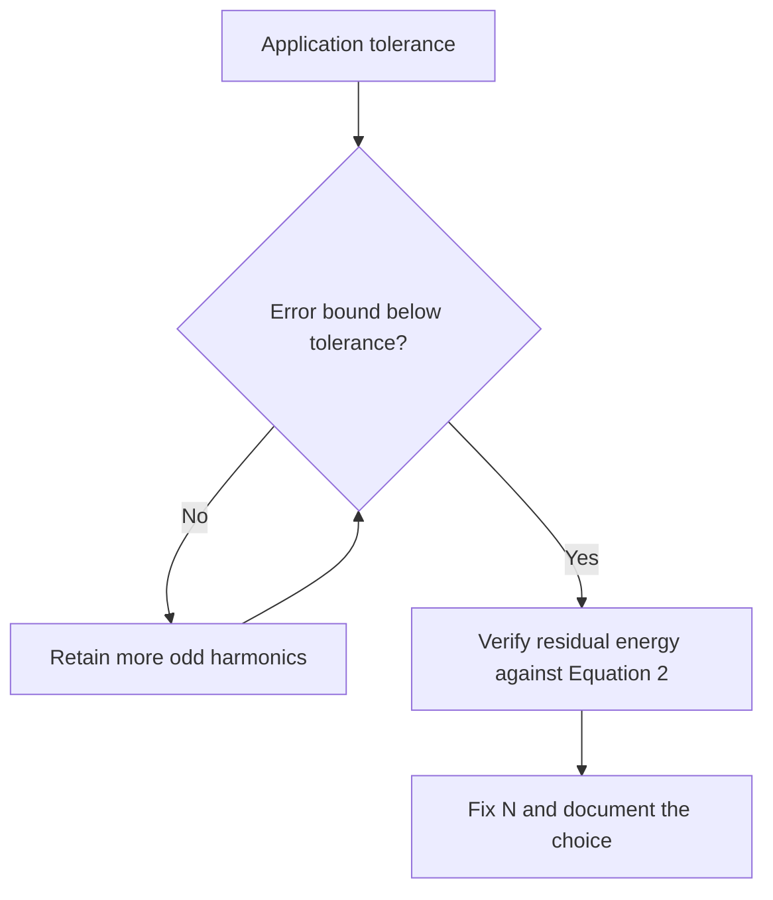

:::heading{role="abstract"}

# Abstract

:::

This companion manuscript accompanies a minimal Fourier-approximation study with
interactive explanations: a decision diagram, an interactive schematic island,
and a referenced animation embed. The study itself is deliberately small, so the
export behavior stays inspectable. The manuscript verifies that author metadata,
citations, equations, a plotted figure, a results table, and the authored static
fallbacks of every interactive element survive conversion into journal
manuscripts. Print and PDF targets receive the authored prose, never the
unexecuted behavior, and the export manifest names each reduction explicitly.

:::heading{label="sec:introduction"}

# Introduction

:::

Finite signal approximations are best understood as orthogonal projections onto
a chosen basis: the retained coefficients are coordinates, and the mean-square
error measures the part of the signal that lives outside the retained subspace
:cite[shannon1949]. The historical line from Fourier's heat treatise to modern
discrete computation is well documented :cite[fourier1878], including the
convergence subtleties near discontinuities raised in Gibbs's correspondence
:cite[gibbs1899].

This manuscript exists to exercise an export pipeline rather than to claim new
signal-processing results. Its specific question: when a paper is authored with
interactive companions, what exactly does a journal export receive? The answer
must be structural, not aspirational. Every interactive block in
Section :ref[sec\:interactive] carries an authored static fallback, and the
export manifest must account for each one.[^fixture-note]

:::heading{label="sec:model"}

# Mathematical Model

:::

Consider a unit-amplitude square wave over one period and retain the first N
nonzero odd harmonics of its Fourier sine expansion. The coefficients follow
from projecting the signal onto the sine basis:

:::equation{label="eq:coefficients"}

$$
a_k=\frac{4}{\pi}\int_{0}^{\pi}\frac{\sin((2k+1)x)}{2k+1}\,dx
=\frac{4}{\pi(2k+1)}.
$$

:::

Because the basis is orthogonal, the normalized mean-square error of the
retained projection follows from the omitted coefficients alone:

:::equation{label="eq:error"}

$$
E_N=1-\frac{8}{\pi^2}\sum_{k=0}^{N-1}\frac{1}{(2k+1)^2}.
$$

:::

Equation :ref[eq\:error] is the complete experimental instrument of this study.
No random sampling, learned parameters, or external dataset is involved. The
PDF compiler consumes the already authored manuscript and local assets; it never
executes the experiment.

:::heading{label="sec:results"}

# Results

:::

Figure :ref[fig\:convergence] plots Equation :ref[eq\:error] over a range of
retained harmonics, and Table :ref[tab\:errors] lists the values at the
evaluated points. The error decreases by roughly a factor of four whenever N
doubles, consistent with the dominant omitted term. These numbers describe this
exact fixture only.

::::figure{src="./paper-convergence.png" alt="Normalized mean-square error of the square-wave projection decreasing with the number of retained odd harmonics" label="fig:convergence"}
:::caption
Normalized mean-square error $E_N$ from Equation :ref[eq\:error] as the number
of retained odd harmonics grows. The deterministic plot is an export asset.
:::
::::

::::table{label="tab:errors" headerRows="1"}

| Retained odd harmonics N | Normalized error E_N |
| ------------------------ | -------------------- |
| 1                        | 0.189431             |
| 3                        | 0.066944             |
| 7                        | 0.028900             |
| 15                       | 0.013504             |

:::caption
Analytic normalized mean-square error evaluated from Equation :ref[eq\:error].
:::
::::

:::heading{label="sec:interactive"}

# Interactive Companions and Their Print Reductions

:::

The web edition of this manuscript ships three interactive companions. Each one
carries authored static prose, and each print export must substitute exactly
that prose. This section is deliberately the demonstration: the diagram, the
schematic island, and the animation embed below are the objects whose export
behavior the manifest must account for.

The first companion is a decision diagram for choosing a refinement level:

::::diagram{engine="mermaid" label="diagram:tolerance" alt="Pick the number of retained harmonics by comparing the analytic error bound with the application tolerance, then verify the residual energy."}



:::caption
Refinement stops when the analytic bound, not the visual appearance of a plot,
meets the tolerance.
:::

:::fallback
In print, the decision procedure reduces to three steps: evaluate the analytic
error bound for a candidate N; retain more odd harmonics while the bound exceeds
the application tolerance; and record the final N together with its residual
energy before the manuscript is finalized.
:::
::::

The second companion reuses the repository's counter island as a minimal
schematic. It does something in the web edition and must do nothing in print:

::::interactive{type="publisle:interactive-schematic" schemaVersion="2" activation="interaction"}
:::title
Keep a manual count of evaluated refinement steps
:::

:::description
The island displays an integer count. Each press marks one candidate N whose
error bound was evaluated, mirroring the loop in the decision diagram above.
:::

:::instructions
Press Clock to advance the manual count and Reset to return it to zero. The
count is transient viewer state and is never part of the exported manuscript.
:::

:::fallback
The manual counter starts at zero. The refinement study can be completed
without activating it.
:::

```publisle-payload
{ "source": "./fourier-clock.json" }
```

::::

The third companion references an external animation. The export pipeline never
fetches it; the authored description is the content:

::::embed{provider="example" resource="projection-geometry-animation" title="Animated orthogonal projection of a vector onto a plane"}
:::caption
The animation shows the projection of $v$ onto the plane and the residual that
completes $v=q+r$.
:::

:::fallback
In the animation, a vector of length $\sqrt{3.74}$ is projected onto the
horizontal plane; its projection has length $\sqrt{2.74}$ and the unit-length
residual completes the right triangle. The relation $v=q+r$ with
$q\perp r$ is the entire geometric content, and it is restated in the printed
text here.
:::
::::

The export manifest for this manuscript must therefore list one
research-block-reduced loss for the diagram, one for the embed, and one
research-block-fallback loss for the schematic island. A silent omission of any
of these is an export failure, not a formatting choice.

:::heading{label="sec:conclusion"}

# Conclusion

:::

The study demonstrates that a playground-authored document can carry research
apparatus and interactive companions through a single export path into journal
themes. The structural claims are small and checkable: metadata, citations,
equations, figure, table and fallbacks survive; behavior does not execute; and
every reduction is named. Extending the template registry or the citation
corpus must preserve these properties.

[^paper-note]:
    This manuscript is an illustrative software fixture with fictional
    authors and institutions. Its interactive elements are demonstration islands
    from the repository, not scientific instruments.

:::bibliography

```json
[
  {
    "id": "shannon1949",
    "type": "article-journal",
    "authors": ["Shannon, Claude E."],
    "title": "Communication in the Presence of Noise",
    "issued": "1949",
    "containerTitle": "Proceedings of the IRE",
    "volume": "37",
    "issue": "1",
    "page": "10--21",
    "doi": "10.1109/JRPROC.1949.232969"
  },
  {
    "id": "fourier1878",
    "type": "book",
    "authors": ["Fourier, Joseph B. J."],
    "title": "The Analytical Theory of Heat",
    "issued": "1878",
    "publisher": "Cambridge University Press",
    "address": "Cambridge"
  },
  {
    "id": "gibbs1899",
    "type": "article-journal",
    "authors": ["Gibbs, Josiah Willard"],
    "title": "Fourier's Series",
    "issued": "1899",
    "containerTitle": "Nature",
    "volume": "59",
    "page": "200"
  }
]
```
